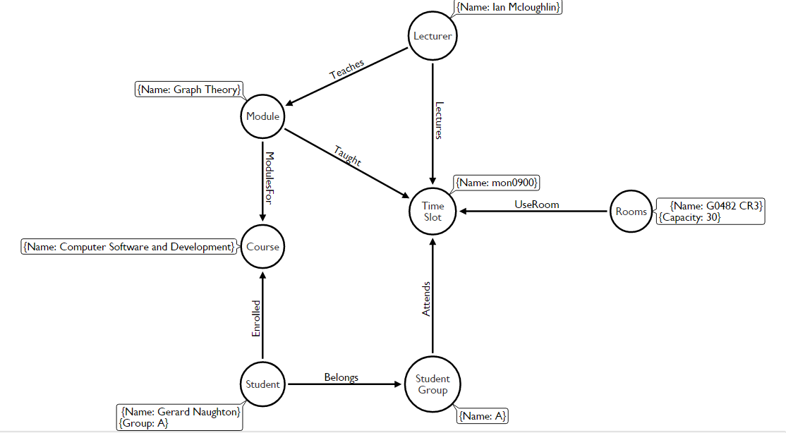

# GraphTheoryProject
Graph Theory project to create and design a Neo4j database and prototype for a third level college timetabling system.

## [Contents](#contents)
[Introduction](#intro)  
[What is Neo4j](#neo4j)  
[Data to be Stored](#data)  
[How data was retrieved](#dataRetrieval)  
[Design Strategy](#strategy)  
[Implementation](#implementation)
[Querying the Database](#queries)    
[Conclusion](#conclusion)   
[References](#references)

## Introduction 
In my project I will design neo4j database and outline the steps I took to achieve this. This includes going through what data was needed, How I would retrieve the data that needed to be stored, my design strategy for the database eg node, edges and there attributes and the relationship between them, how to implement the design and finally conclusion.

## What is Neo4j 

Neo4j is a graph database management system. It is developed by Neo Technology. It is a [ACID](https://en.wikipedia.org/wiki/ACID)-compliant transactional database wnith native graph storage and processing.

Neo4j is available in many different licences depending on your needs. I am using the open-source community edition. Neo4j is java based and accessible from software written in other languages using the their Cypher Query language. Similar to the way mySql has sql language.

In a neo4j database the data is structured and stored using edges, nodes and attributes. Each node and edge can have any number of attributes. Nodes and edges can also have labels which can help narrow down searches of the database.

Neo4j is quickly becoming one of the leaders not just in graph databases but databases in general. With its high performant read and write scalability, without compromise. With figures of over 1 million downloads and growing at a rate of 50000 downloads a month, it looks set that neo4j is here to stay.

Here are some of the big name companies using Neo4j:
* Walmart
* eBay
* Adidas
* Cisco

For more information about neo4j here are some links that may help:
* https://en.wikipedia.org/wiki/Neo4j
* https://neo4j.com/top-ten-reasons/

## Data to be stored 
Firstly before I designed the database I worked out the essential items needed to populate a Time Table.

* TimeSlots - List of Times for each class. These would be in hour intervals
* Rooms - Rooms available and their properties eg capacity
* Courses - List of courses for that college
* Modules - List of Modules for that given course
* Lecturers - List of Lecturers for the college
* Groups - List of Groups for that course and year
* Students - List of Students who are in enrolled in that course

All this Data for Rooms, Lecturers and Modules will be got from the GMIT. Galway mayo institute of technology - web timetables.
http://timetable.gmit.ie/.
For groups and Students I will create sample data and apply it to my database.
For my prototype I will be basing my database on our current semester 6 Computer Software and development time table.

## How Data was retrieved 

How we retrieved the data from GMIT. Galway mayo institute of technology - web timetables.
http://timetable.gmit.ie/.

## Design Strategy 

After figuring out what data needed to be stored I moved on to the design.  

So for each piece of data to be stored it would be stored as a specific type of node.
For Example: Student would represent that type of node.
Then each Student node would contain attributes.
For my Student node I gave it 2 attributes, Name and Group.
These would represent the students name and which group they belong to.

To help me understand what attributes I needed, I used a very handy Arrow tool by apcjones. This helped me visualise the nodes and how each one would relate to each other. Which in turn helped me figure out the node relationships.
Here is a image of apcjones design.

As you can see from the image above each node represents a certain type of data and each edge represents their relationship. Each Node has attribute which are in the text boxes beside them.

For my Design I kept a simple design. The main node in my database is the Time/Time Slot Node. For each Time Slot there must be a Lecturer, Room, Student Group and a Module. These are all necessary to create a Time Slot in a Time Table.   
Each one of these has a relationship pointing towards the Time Slot node.
These are represented by the edges with black filled arrows pointing towards the Time Node. Each Edge has a Type of Relationship.
For Example a Lecturer Lectures at a given Time Slot. The relationship will be *Lectures*.
These relationships will allow me to query my database.

As well as creating my relationships with the Time Slot I also created relationships between Lecturer and Module represented by *Teaches*, Student and Student Group represented by *Belongs*, Student and Course represented by *Enrolled* and finally Module and Course represented by *ModulesFor*. All these relationship helps me query the database easier and require less complicated Queries.

## Implementation 

//implementation of data to database

## Querying the Graph database 

//queries i used
## Conclusion
how i found the project
would i recommend it
references

## References
https://neo4j.com/developer/guide-import-csv/
### Images
https://pbs.twimg.com/profile_images/799385008427274240/SecICcL4.jpg
