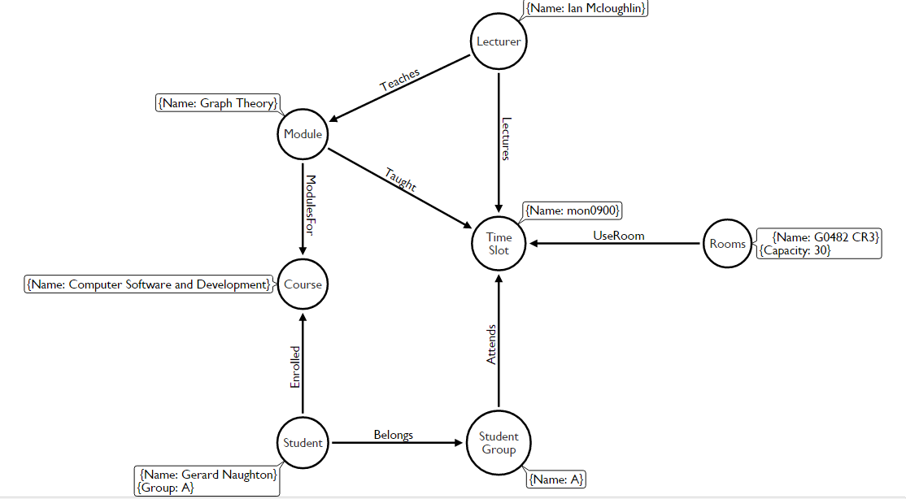
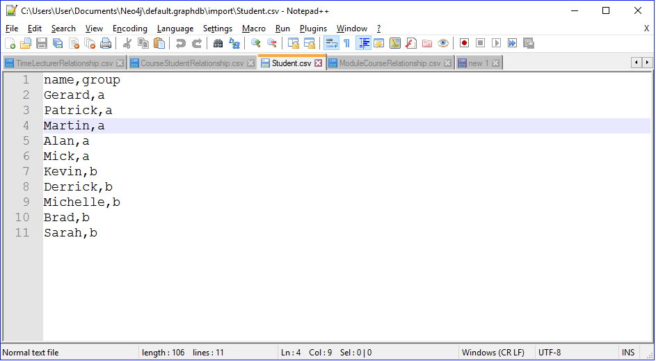
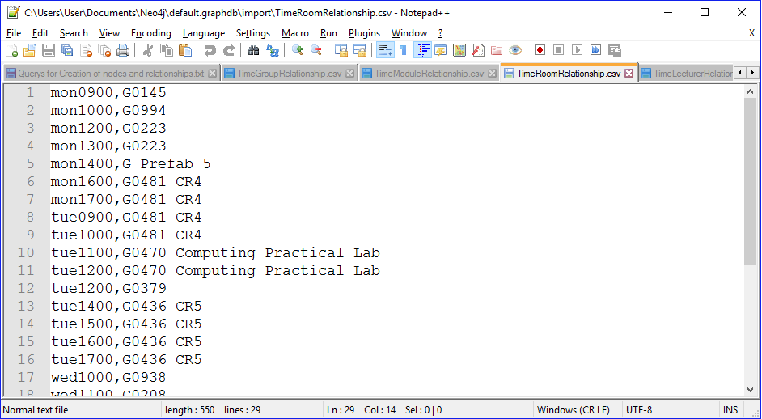

# GraphTheoryProject
Graph Theory project to create and design a Neo4j database and prototype for a third level college timetabling system.

## [Contents](#contents)
[Introduction](#intro)  
[What is Neo4j](#neo4j)  
[Data to be Stored](#data)  
[How data was retrieved](#dataRetrieval)  
[Design Strategy](#strategy)  
[Implementation](#implementation)
[Querying the Database](#queries)    
[Conclusion](#conclusion)   
[References](#references)

## Introduction <a name = "intro"></a>
In my project I will design neo4j database and outline the steps I took to achieve this. This includes going through what data was needed, How I would retrieve the data that needed to be stored, my design strategy for the database eg node, edges and there attributes and the relationship between them, how to implement the design and finally conclusion.

## What is Neo4j <a name = "neo4j"></a>


Neo4j is a graph database management system. It is developed by Neo Technology. It is a [ACID](https://en.wikipedia.org/wiki/ACID)-compliant transactional database wnith native graph storage and processing.

Neo4j is available in many different licences depending on your needs. I am using the open-source community edition. Neo4j is java based and accessible from software written in other languages using the their Cypher Query language. Similar to the way mySql has sql language.

In a neo4j database the data is structured and stored using edges, nodes and attributes. Each node and edge can have any number of attributes. Nodes and edges can also have labels which can help narrow down searches of the database.

Neo4j is quickly becoming one of the leaders not just in graph databases but databases in general. With its high performant read and write scalability, without compromise. With figures of over 1 million downloads and growing at a rate of 50000 downloads a month, it looks set that neo4j is here to stay.

Here are some of the big name companies using Neo4j:
* Walmart
* eBay
* Adidas
* Cisco

For more information about neo4j here are some links that may help:
* https://en.wikipedia.org/wiki/Neo4j
* https://neo4j.com/top-ten-reasons/

[Top](#contents)
## Data to be stored <a name = "data"></a>

Firstly before I designed the database I worked out the essential items needed to populate a Time Table.

* TimeSlots - List of Times for each class. These would be in hour intervals
* Rooms - Rooms available and their properties eg capacity
* Courses - List of courses for that college
* Modules - List of Modules for that given course
* Lecturers - List of Lecturers for the college
* Groups - List of Groups for that course and year
* Students - List of Students who are in enrolled in that course

All this Data for Rooms, Lecturers and Modules will be got from the GMIT. Galway mayo institute of technology - web timetables.
http://timetable.gmit.ie/. (You must be a student to view this link)
For groups and Students I will create sample data and apply it to my database.
For my prototype I will be basing my database on our current semester 6 Computer Software and development time table.

[Top](#contents)
## How Data was retrieved <a name = "dataRetrieval"></a>

As I said before I would obtain my data from GMIT. Galway mayo institute of technology - web timetables.
http://timetable.gmit.ie/.(You must be a student to view this link)

After finding the right information needed I clicked inspect element of the webpage and copied and pasted the information I needed into notepad++.

Once I had it in notepad++ I was able to remove html tags, white spaces and other unwanted information caught in between with Find and Replace all functions(Ctrl f shortcut).

I also found as a handy tool was how notepad++ allows you by pressing alt and dragging the mouse to select items of text vertically. This was very handy when removing large lumps of unwanted text.

Once the necessary information was collected it was ready to be inputted into my csv files for upload to the database.

[Top](#contents)
## Design Strategy <a name = "strategy"></a>

After figuring out what data needed to be stored I moved on to the design.  

So for each piece of data to be stored it would be stored as a specific type of node.
For Example: Student would represent that type of node.
Then each Student node would contain attributes.
For my Student node I gave it 2 attributes, Name and Group.
These would represent the students name and which group they belong to.

To help me understand what attributes I needed, I used a very handy Arrow tool by apcjones. This helped me visualise the nodes and how each one would relate to each other. Which in turn helped me figure out the node relationships.
Here is a image of apcjones design.



As you can see from the image above each node represents a certain type of data and each edge represents their relationship. Each Node has attribute which are in the text boxes beside them.

For my Design I kept a simple design. The main node in my database is the Time/Time Slot Node. For each Time Slot there must be a Lecturer, Room, Student Group and a Module. These are all necessary to create a Time Slot in a Time Table.   
Each one of these has a relationship pointing towards the Time Slot node.
These are represented by the edges with black filled arrows pointing towards the Time Node. Each Edge has a Type of Relationship.
For Example a Lecturer Lectures at a given Time Slot. The relationship will be *Lectures*.
These relationships will allow me to query my database.

As well as creating my relationships with the Time Slot I also created relationships between Lecturer and Module represented by *Teaches*, Student and Student Group represented by *Belongs*, Student and Course represented by *Enrolled* and finally Module and Course represented by *ModulesFor*. All these relationship helps me query the database easier and require less complicated Queries.

[Top](#contents)
## Implementation <a name = "implementation"></a>

After looking into neo4j and watching tutorials, I realised the best way to input the data/node and relationships between them consistently and easily would be to upload the data into neo4j using CSV files.

In order to be able to import the CSV data to the database I would have to create a import folder in my graph database folder. In here I would place all my CSV Files.

### Node Creation

To begin with I started with the nodes and its attributes to be stored. I created the csv files using notepad++.

I would require:

* Time.csv
* Room.csv
* Module.csv
* Lecturer.csv
* Group.csv
* Student.csv

I entered the course node manually without a csv as their was only one instance for this prototype.

Here is a example of a csv file to create nodes:



As you can see above Line 1 Consists of the headers for each column and each column is separated by a comma.
In this example the headers represent the name of the student and the group name.

To upload the file to the database I used this Cypher command:

```
LOAD CSV WITH HEADERS FROM "file:///C:/Student.csv" AS csvLine
CREATE (s:Student { Name: csvLine.name, Group: csvLine.group})
```

As you can see you load in the Student.csv file with its HEADERS first and then using the Create command you create a Student node with the Attributes given in the csv file.

This was then repeated for the other data to be stored

### Relationship Creation

Creating the csv and the cypher command for the Relationships was very similar.

For the CSV files everything was the same except there was no header. Each relationship was done per line and each attribute was separated by a comma.

I would require:

* TimeLecturerRelationship.csv
* TimeRoomRelationship.csv
* TimeModuleRelationship.csv
* TimeGroupRelationship.csv
* CourseStudentRelationship.csv
* ModuleLecturerRelationship.csv
* ModuleCourseRelationship.csv

Here is a example of a csv file I created to make a Relationship between Time Slots and Room names/numbers:



As you can see above there is no headers this time.

To upload the file to the database I used this Cypher command:

```
USING PERIODIC COMMIT
LOAD CSV FROM "file:///C:/TimeRoomRelationship.csv" AS row
MATCH (p1:Time {Name: toString(row[0])}), (p2:Room {Name: toString(row[1])})
CREATE (p2)-[:UseRoom]->(p1);
```

Using Periodic Commit is not really necessary for this database as we are not using large quantities of data but is a good practice for when dealing with larger databases rather than trying to upload all the data in one go.

Again we can see that we load in the specific CSV file needed but what is different is that we match the attributes using rows.
As we work down through each row in the file they access the attribute data using  "(row[0])" which represents the first item in that row and "(row[1])" for the second.

This is just another example of getting data from a file.

To create the relationship between student and groups i used this command:

```
Match (Student {Group:"a"}), (Group {Name:"a"})
Create(Student)-[:Belongs]->(Group)
Return Student, Group
```

Using these 3 cypher command and changing them depending on the different nodes and relationships I was able to implement my data and create my graph database.

[Top](#contents)
## Querying the Graph database <a name = "queries"></a>

Here are some of the Queries I performed after creating my database:

Query to find what Lecturer Teaches Graph Theory:
```
MATCH(m:Module)-[:Teaches]-(l:Lecturer)
WHERE m.Name = "Graph Theory"
RETURN l
```

Query to see what time does Gerard have graph theory on a friday:
```
MATCH (s:Student {Name:"Gerard"})-[r1:Belongs]->(g:Group)-[r2:Attends]->(t:Time)<-[r3:Taught]-(m:Module)
WHERE t.Name CONTAINS 'fri' AND m.Name = 'Graph Theory'
RETURN t
```

Query to see what class room and time does Student Gerard have on a wednesday with a class room greater than 90
```
MATCH (s:Student {Name: "Gerard"})-[r1:Belongs]->(g:Group)-[r2:Attends]->(t:Time)<-[r3:UseRoom]-(r:Room) WHERE t.Name CONTAINS 'wed' AND toInt(r.Capacity) >= 90
RETURN t,r
```
I have provided more Queries in my CommandsAndQueries.txt file which is in my repository.

[Top](#contents)
## Conclusion<a name = "conclusion"></a>

Having worked mainly with Mysql, it was great to see what else was out there. Neo4j is the leading Graph Database out there and with its free community edition it is great aid for students to learn.

At first I found it hard to get my head around the cypher language but after following the helpful tutorials that come with neo4j desktop and some tutorials online I was learning quickly that this was easy and well designed language.

As for my Timetable database at first it sounded a bit daunting but as explained by our lecturer Ian McLoughlin if broken into small step by step sections it becomes clear and easy how it should be done.


[Top](#contents)
## References<a name = "references"></a>

For loading of csv files to neo4j  
https://neo4j.com/developer/guide-import-csv/  

How to delete relationships and nodes in cypher  
http://stackoverflow.com/questions/19016947/neo4j-how-do-i-delete-a-specific-relationship-with-cypher  

How to remove tags using regular expressions and Find and Replace functions  
https://www.rhyous.com/2012/12/11/removing-all-xml-or-html-tags-using-notepad/

Also Neo4j Desktop which has loads of documentation on how to get started
### Images
Neo4j Image
https://pbs.twimg.com/profile_images/799385008427274240/SecICcL4.jpg

[Top](#contents)
